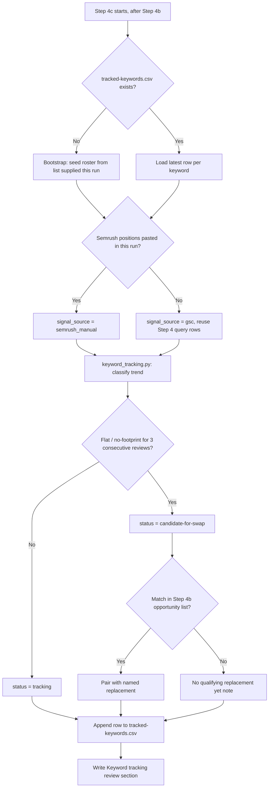

# Monthly keyword-tracking review in seo-performance-report

## Summary

Add a step to the existing `seo-performance-report` skill that reviews the
10 keywords tracked in Semrush's free-tier rank tracker once a month, flags
any that have gone stale, and suggests a specific replacement — as a manual
action list, since nothing can be written back to Semrush programmatically.

## Problem Frame

The site tracks 10 keywords in Semrush's Position Tracking tool (free-plan
hard cap; MCP has no write access and no live query/position read access on
this plan). Search Console already gives free, unlimited, per-query position
and impression data, so Semrush's remaining value here is specifically its
continuous historical trend graph and weekly email digest — which the user
wants preserved, not churned. Nothing in the repo currently records which 10
keywords are tracked, and nothing checks whether any of them have stopped
earning their slot. This plan closes that gap: once a month, alongside the
existing performance snapshot, flag flat keywords and pair each with a named
replacement candidate already surfaced by the report's own opportunity
mining — all without ever calling Semrush.

## Requirements

**Persistence**
- R1. A committed, append-only record tracks which keywords are currently in
  Semrush's rank tracker — nothing in the repo does this today.
- R2. Each monthly run appends one row per tracked keyword with its current
  position/impression signal and derived trend, using no live Semrush API or
  MCP call.

**Staleness detection and suggestions**
- R3. A tracked keyword with no meaningful position movement across 3
  consecutive monthly reviews is flagged as a swap candidate.
- R4. Each swap candidate is paired with a specific replacement sourced from
  that same run's already-computed Search Console opportunity list, when one
  exists.
- R5. When no qualifying replacement exists yet, the report says so rather
  than forcing a weak suggestion.

**Output**
- R6. The monthly snapshot gains a "Keyword tracking review" section showing
  every tracked keyword's status, plus a manual action list when candidates
  exist.
- R7. Nothing in this feature writes to Semrush — all suggested changes are
  manual, applied by the user in the Semrush web UI.

**Signal source**
- R8. The review defaults to Search Console data for each tracked keyword's
  position, reusing data the run already pulls at no extra cost.
- R9. The review accepts an optional richer input — Semrush position numbers
  pasted in for that run — recorded as a distinct signal source from the GSC
  default.

## Key Technical Decisions

- **New dedicated file, not the optimization ledger**: `ledger.csv`/`checks.csv`
  are shaped around per-post WordPress edits (`post_id`, `changed` field,
  Yoast-postmeta `backup` path, ship-verification). A tracked Semrush keyword
  has none of that — it needs its own store (`reports/seo-performance/tracked-keywords.csv`).
- **One append-only file, not a roster+log pair**: unlike the ledger/checks
  split (which exists because "applied" and "verified" are genuinely separate
  events), a tracked keyword's roster *is* its most recent row. One file, one
  row per keyword per review, keeps "current roster" and "history" the same
  artifact.
- **GSC by default, manual Semrush paste-in as opt-in**: the review never
  calls Semrush. It reads each tracked keyword's position from the
  `gsc_query` rows the run already pulls in Step 4 — free, no new calls. When
  the user pastes in that month's actual Semrush numbers, the run records
  `signal_source=semrush_manual` instead, for a sharper read on demand.
- **Flat threshold reuses this skill's own calibrated numbers**: "flat" =
  position moves less than 1.0 across 3 consecutive reviews; "no footprint" =
  under the ~50-impression floor for 3 consecutive reviews. Both numbers are
  the same ones Step 4a already uses for its own verdict and impression-floor
  rules — reused rather than invented fresh, and loosened slightly (0.5 → 1.0)
  since this is a slower multi-month signal, not a single before/after check.
  3 consecutive reviews (~3 months) is a tunable default, not a hard rule.
- **Replacement candidates come from Step 4b, not a fresh GSC pull**: Step 4b
  already mines the run's striking-distance/low-CTR opportunity list. The new
  step runs immediately after it and draws from that same list, so no keyword
  discovery logic is duplicated and no extra API call is spent.
- **Output is a manual action list, always**: consistent with the confirmed
  plan-level constraint that Semrush can't be written to from this session.
- **Trend math lives in a small script, not prose**: `tools/keyword_tracking.py`
  mirrors `tools/seo_cache.py`'s shape (stdlib-only, argparse subcommands,
  clear exit codes) so the append-only file and the flat/rising/falling/new
  classification are deterministic and testable, instead of asking the
  report-writing step to eyeball a growing CSV by hand.

## High-Level Technical Design

## Implementation Units

### U1. Tracked-keyword store and trend-detection script

**Goal:** Give the review something to read and write each month, and make
the flat/rising/falling/new classification deterministic.

**Requirements:** R1, R2, R3, R8, R9

**Dependencies:** none

**Files:**
- `reports/seo-performance/tracked-keywords.csv` (new)
- `tools/keyword_tracking.py` (new)
- `tools/test_keyword_tracking.py` (new)

**Approach:** CSV columns: `review_date,keyword,category,months_tracked,signal_source,position,impressions,trend,status,note`.
Append-only, one row per `(keyword, review_date)`; the current roster is the
most recent row per distinct keyword. `signal_source` is `gsc` or
`semrush_manual`. `trend` is one of `new / flat / rising / falling /
no-footprint`. `status` is one of `tracking / candidate-for-swap /
recently-swapped`.

`tools/keyword_tracking.py` follows `tools/seo_cache.py`'s shape (stdlib
only, argparse subcommands, exit codes):
- `latest` — print the current roster (most recent row per keyword).
- `append` — write this run's rows from stdin TSV (`keyword,category,signal_source,position,impressions`), computing `months_tracked`, `trend`, and `status` from the keyword's prior rows.
- `bootstrap` — seed the file for the very first run from a supplied keyword list, all rows `trend=new`, `status=tracking`, `months_tracked=0`.

**Patterns to follow:** `tools/seo_cache.py` for CLI shape, stdlib-only
constraint, and TSV-over-stdin input convention.

**Test scenarios:**
- First-ever row for a keyword → `trend=new`, `status=tracking`.
- 3rd consecutive row within 1.0 position of the prior 2 → `trend=flat`,
  `status=candidate-for-swap`.
- Position improved by ≥1.0 since 2 reviews ago → `trend=rising`.
- Keyword present in the roster but absent from this run's input entirely
  (0 impressions) → `trend=no-footprint`, distinct from `falling`.
- Fewer than 3 rows exist yet for a keyword → trend still computed, but
  `status` stays `tracking` even if flat, since it isn't eligible yet.
- Missing `tracked-keywords.csv` on `bootstrap` → creates the file with a
  header rather than erroring.
- Same keyword appears with two different `category` values across rows →
  `append` warns rather than silently picking one.

**Verification:** `tools/test_keyword_tracking.py` passes locally
(`python3 -m unittest tools/test_keyword_tracking.py`); a manual `bootstrap`
+ three `append` runs against a scratch copy of the file produce the roster
state described above.

---

### U2. Step 4c — Keyword tracking review, in `seo-performance-report`

**Goal:** Run the review as part of the existing monthly report, without any
new API calls.

**Requirements:** R2, R3, R4, R5, R7, R8, R9

**Dependencies:** U1

**Files:**
- `.claude/skills/seo-performance-report/SKILL.md`

**Approach:** New step, "Step 4c — Keyword tracking review," sequenced right
after Step 4b (opportunity mining) so it can draw replacement candidates from
Step 4b's already-computed list instead of re-querying GSC. For each tracked
keyword, look up its position/impressions from the Step 4 `gsc_query`
results already pulled this run (reuse — the 10 keywords are a small subset
of what Step 4 already returns); if the user has pasted current Semrush
position numbers into this run's conversation, use those instead and record
`signal_source=semrush_manual`. Feed the run's readings to
`tools/keyword_tracking.py append`. For any keyword now `candidate-for-swap`,
pick 1-2 replacements from Step 4b's opportunity list, excluding anything
already tracked, and note the exact striking-distance position/impressions
that make it a candidate; if nothing in this run's opportunity list
qualifies, say so explicitly rather than forcing a suggestion. On the very
first run (file doesn't exist), bootstrap the roster from a list the user
supplies inline and skip swap suggestions this run — no keyword can have 3
reviews yet. Every step reminds the user to confirm the roster still matches
what's actually live in Semrush, since the file has no way to detect drift.

**Patterns to follow:** Step 4a's existing shape (select due items, read
without external calls where possible, write results, one line when nothing
is due) and its exact threshold values (≥0.5 position / ~50-impression
floor), reused per the Key Technical Decisions above.

**Test scenarios:** Prose skill instructions executed by an agent each
month; scenarios are dry-run walkthroughs an implementer can reason through
before shipping:
- Roster file doesn't exist yet → step bootstraps from a user-supplied list,
  seeds all keywords `trend=new` / `status=tracking`, suggests no swaps.
- 2 of 10 keywords reach `candidate-for-swap` this run → step surfaces
  exactly those 2, each with a specific named replacement from Step 4b.
- A `candidate-for-swap` keyword has no qualifying replacement in this run's
  opportunity list → step states that explicitly.
- User pastes in Semrush's actual positions this run → those values are used
  and recorded as `signal_source=semrush_manual`.

**Verification:** Running the updated skill against a scratch copy of the
tracked-keywords file produces the four scenarios above with no live
Semrush call at any point.

---

### U3. Report template and monthly wrap-up

**Goal:** Surface the review's output in the report a human actually reads.

**Requirements:** R6

**Dependencies:** U2

**Files:**
- `.claude/skills/seo-performance-report/SKILL.md`

**Approach:** Add a "## Keyword tracking review" section to the Step 5
report template: a table of every tracked keyword (keyword, months tracked,
signal source, position, trend, status), followed by a "Suggested swaps
(manual — apply in Semrush)" subsection rendered only when at least one
candidate exists. Step 7's closing verbal read (top 1-3 actions) mentions a
swap suggestion when one exists, alongside the existing on-site actions.

**Patterns to follow:** The existing report template's conditional-section
style (e.g. "no optimizations came due this month" one-liner when Step 4a
finds nothing due).

**Test scenarios:** Test expectation: none — template and prose formatting
only; the underlying logic is covered by U2's scenarios.

---

### U4. Documentation

**Goal:** Make the new thresholds and file legible to a future reader
without reverse-engineering them from the script.

**Requirements:** R1, R3

**Dependencies:** U1, U2, U3

**Files:**
- `docs/seo-performance/README.md`
- `reports/seo-performance/README.md`

**Approach:** In `docs/seo-performance/README.md`, add a
"### Tracked-keyword staleness thresholds" subsection under Decision rules
(parallel to the existing "On-site opportunity thresholds"), stating the
flat/no-footprint/candidate rules verbatim, and one new row in the Data
sources table pointing at the tracked-keywords file. In
`reports/seo-performance/README.md`, add a short explainer paragraph
(mirroring the existing "How these are generated" numbered list) plus a
column-and-status-enum table for `tracked-keywords.csv`, matching the depth
of `reports/seo-optimizations/README.md`'s own column documentation.

**Patterns to follow:** `reports/seo-optimizations/README.md`'s structure —
"why this exists," a column table, a status/verdict-meaning table, "who
writes what."

**Test scenarios:** Test expectation: none — documentation only.

## Scope Boundaries

**Deferred to Follow-Up Work**
- The actual content of the 10 tracked keywords, including the open
  cybertruck-vs-домашно-зареждане swap — a separate content decision, not
  part of this tracking mechanism.

**Out of scope**
- Automating writes to Semrush — blocked by the plan/API limitation this
  session confirmed; not revisited here.
- Any rank-tracking system independent of Semrush.
- A repo-wide test runner or CI wiring — only this feature's own test file
  is added; nothing currently runs it automatically.

## Risks & Dependencies

- **Roster drift**: if the user changes the live Semrush tracker without
  updating this file (or vice versa), the two go out of sync and the review
  has no way to detect it — mitigated by U2's reminder line each run, not
  eliminated.
- **GSC position is a proxy, not a substitute**: GSC's average position is
  blended and laggier than Semrush's own daily rank. A `flat` verdict from
  this review means "flat by GSC's proxy signal," not "confirmed flat in
  Semrush" — real until the user pastes in actual numbers via the manual
  path.

## Sources / Research

- `reports/seo-optimizations/ledger.csv`, `checks.csv`, `README.md` — ledger
  schema is tightly coupled to per-post WordPress edits; confirmed not
  reusable for a tracked-keyword record, informing the new-file decision.
- `tools/seo_cache.py` — CLI shape (argparse subcommands, stdlib-only, TSV
  stdin, clear exit codes) mirrored by the new `tools/keyword_tracking.py`.
- `.claude/skills/seo-performance-report/SKILL.md`, Step 4a — source of the
  reused ≥0.5-position and ~50-impression-floor thresholds.
- `.claude/skills/seo-performance-report/SKILL.md`, Step 4b — source of the
  striking-distance opportunity list the new step draws replacement
  candidates from, avoiding a duplicate GSC call.
- Repo-wide search confirmed no existing record of which keywords are
  tracked in Semrush's Position Tracking tool — the only prior "tracked
  keywords" mentions in the repo refer to Semrush's separate Organic
  Research index, a different feature.
