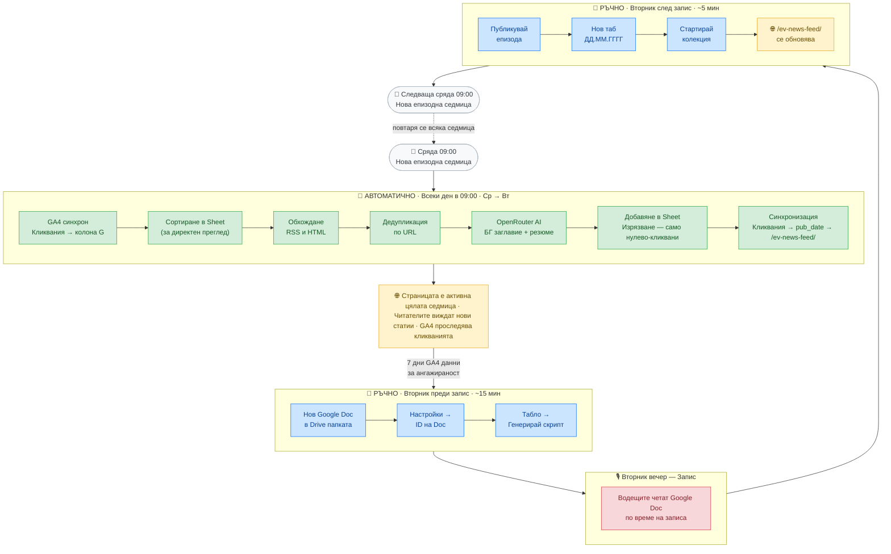

# Работен процес на епизода — Пълен седмичен цикъл

Този документ описва пълния оперативен цикъл за един подкаст епизод.
Разграничава **ръчните стъпки** (извършвани от екипа) от **автоматичните стъпки** (извършвани от плъгина).

---

## 7-дневният прозорец за събиране

Всеки епизод обхваща пълен 7-дневен прозорец:

- **Начало:** Сряда 09:00 — първо автоматично събиране след записа в неделя
- **Край:** Вторник 09:00 — последно автоматично събиране преди записа

Това означава, че когато екипът сяда да запише в Tuesday вечер, активният Sheet вече съдържа пълна седмица статии. Посетителите са имали 7 дни да четат и кликат, така че GA4 данните за ангажираност са богати и най-популярните статии естествено се издигат в горната част на подкаст скрипта.

---

## Блок-схема

---

## Стъпка по стъпка

### Сряда → Вторник 09:00 — автоматично (без действие от екипа)

Всеки ден в 09:00 (местно сайт-времe, конфигурируемо в настройките) WP-Cron изпълнява автоматично:

| Стъпка | Какво се случва |
|---|---|
| GA4 синхрон | Взима броя на `ev_news_click` събитията за всички URL адреси → обновява колона G в активния таб на Sheet |
| Сортиране в Sheet | Пренарежда физическите редове в Sheet по брой кликвания низходящо — само за удобство при директен преглед на таблицата; наредбата на живата страница се определя отделно от следващата стъпка |
| Обхождане | Взима всеки конфигуриран RSS/HTML източник за нови статии |
| Филтриране по възраст | Пропуска статии, публикувани преди повече от 24 часа — кронът се изпълнява всеки ден, така че по-старите статии вече са обработени или нямат актуалност; статии без дата на публикуване се приемат винаги |
| Дедупликация | Пропуска URL адреси, вече налични в Sheet |
| Резюмиране | OpenRouter генерира българско заглавие + 2–3 изречения резюме за всяка нова статия |
| Добавяне | Записва нови редове в Sheet (`clicks=0`, `added_date=днес`, `pub_date` от RSS) |
| Изрязване | Ако общият брой надвишава `max_articles`, премахва най-старите **нулево-кликвани** редове (по `pub_date` ASC). Статиите с поне едно кликване **никога** не се изтриват автоматично |
| Синхронизация | Записва всички редове в `ev_news_live_articles` (wp_options) в наредба: статии с кликвания първо (кликвания низх. → `pub_date` низх.), след тях нулево-кликвани статии от нови към стари (`pub_date` низх.) |

Изпълнението в Вторник 09:00 е последното автоматично събиране преди вечерния запис. По това време екипът разполага с 7 пълни дни статии с натрупани GA4 данни, готови за подкаст скрипта.

Посетителите, зареждащи страницата на предстоящия епизод, виждат актуални данни при всяка заявка — `single.php` взима CSV от Sheet на живо. Страницата **EV News Feed** (`/ev-news-feed/`, WP ID 8851) е статична страница, която винаги показва активния таб. Тя се обновява автоматично след всяко събиране, тъй като `ENA_Sync` записва `ev_news_live_articles` в `wp_options`. **Не се създават нови WP страници на вторник** — статичната страница служи за всички сесии.

---

### Вторник — преди подкаста (ръчно, ~15 мин)

| # | Какво | Къде |
|---|---|---|
| 1 | Създай нов Google Doc в споделената Drive папка за скрипта на днешния подкаст | Google Drive |
| 2 | Постави неговия ID в настройките на плъгина | WP Admin → EV Новини → Настройки → ID на подкаст Doc |
| 3 | Стартирай генерирането на скрипта | WP Admin → EV Новини → Табло → **Генерирай подкаст скрипт** |

Генерирането чете текущия Sheet, сортира статиите по брой кликвания (най-кликваните първо), генерира говорим-стил български резюмета за всяка статия чрез OpenRouter и ги добавя в Google Doc. Отнема няколко минути — стартирай час преди записа.

Нов Google Doc трябва да се създаде за всеки епизод. Плъгинът записва в съществуващ Doc (не може да създава нови Drive файлове поради ограничения на Google API квотата за служебни акаунти).

---

### Вторник вечер — запис

Водещите отварят Google Doc и четат резюметата по време на записа на подкаста.

---

### Вторник — след подкаста (ръчно, ~5 мин)

| # | Какво | Къде |
|---|---|---|
| 1 | Публикувай записания епизод като финална WP публикация (напр. „EV Новини #155") | WP Admin → Публикации |
| 2 | Създай нов таб в Sheet с иМЕ `ДД.ММ.ГГГГ` за следващата сесия (напр. `02.07.2026`) с 9-колонен хедър ред: `title \| description \| link \| author \| upvote \| downvote \| clicks \| added_date \| pub_date` | Google Sheets |
| 3 | Стартирай начална колекция | WP Admin → EV Новини → Табло → **Стартирай колекция** |

След стъпка 3 страницата `/ev-news-feed/` вече показва статиите на новата сесия — **същата вечер, в която е записан подкастът**. Плъгинът автоматично открива най-новия `ДД.ММ.ГГГГ` таб като активен. Автоматичният дневен cron поема от сряда сутринта.

> **Важно:** не се създава нова WP страница за всяка сесия. Статичната страница `/ev-news-feed/` (WP ID 8851) обслужва всички сесии — съдържанието й се определя от активния таб на Sheet.

---

## Какво плъгинът никога не пипа

- Съдържанието на WP публикациите на епизодите
- `news_csv` post мета на минали епизодни публикации (тези остават непроменени)
- Минали епизодни публикации и техните данни
- Настройките или шаблона на статичната страница `/ev-news-feed/`

> **Забележка — наредба и изрязване:** Плъгинът сортира физическите редове в Sheet по брой кликвания (за по-лесен директен преглед), но **наредбата на /ev-news-feed/** се определя отделно при синхронизацията: статии с кликвания се показват най-горе (брой кликвания низх. → дата на публикуване низх.), следвани от нулево-кликвани статии от нови към стари (дата на публикуване низх.). При изрязване до лимита се премахват само **нулево-кликвани** редове — и то най-старите по дата на публикуване. Статии с поне едно кликване никога не се изтриват автоматично.
