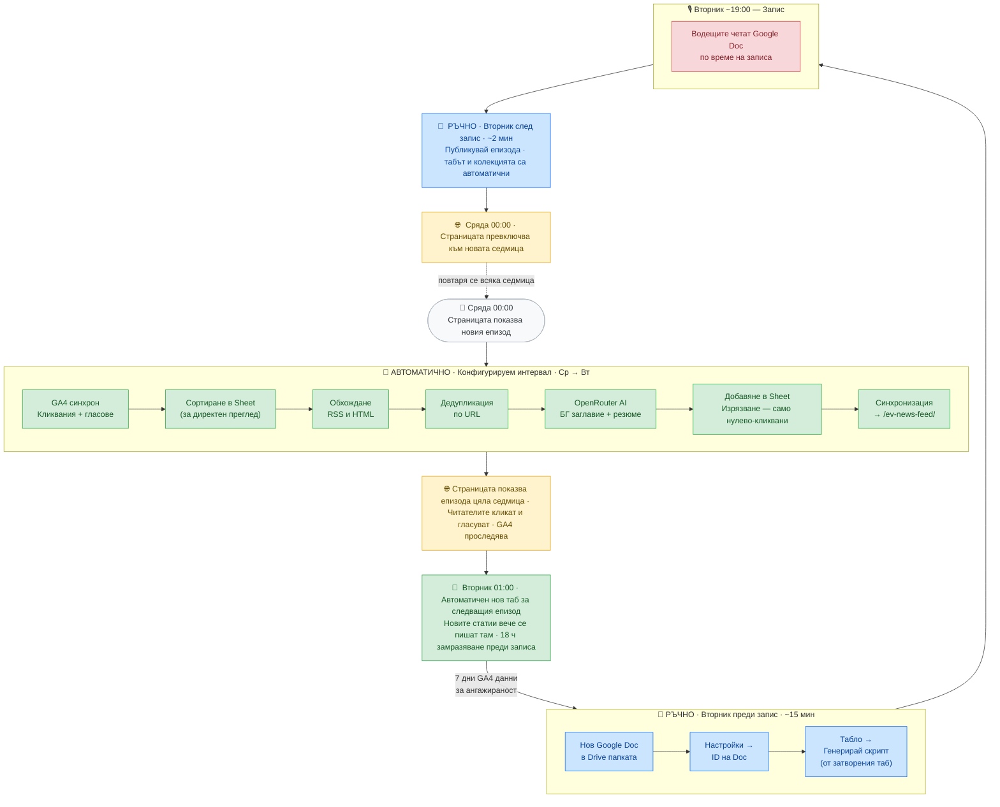

# Работен процес на епизода — Пълен седмичен цикъл

Този документ описва пълния оперативен цикъл за един подкаст епизод.
Разграничава **ръчните стъпки** (извършвани от екипа) от **автоматичните стъпки** (извършвани от плъгина).

---

## 7-дневният прозорец за събиране

Всеки епизод има собствен таб в Sheet, кръстен на вторника на записа (`ДД.ММ.ГГГГ`). Плъгинът управлява три автоматични превключвания през седмицата — **екипът вече не създава таб ръчно**:

| Момент | Какво прави плъгинът |
|---|---|
| **Вторник 01:00** — 18 ч преди записа | Създава автоматично таба на следващия епизод и започва да пише новите статии в него. Статиите, събрани в последните 18 ч преди записа, отиват в **следващия** епизод, не в тазвечерния. |
| **Вторник ~19:00** — запис | Скриптът се генерира от **току-що затворения** таб (този, който е събирал изминалата седмица и е затворен в 01:00 същата сутрин). |
| **Сряда 00:00** — превключване на страницата и скрипт-източника | Живата страница **и** източникът на подкаст скрипта задържат излъчения епизод през нощта след записа и заедно превключват към новата седмица в сряда (не при записа). |

**Пример (епизод от 28.07):** табът `28.07.2026` събира от вторник 21.07 01:00 до вторник 28.07 01:00 и се записва във вторник 28.07 вечерта. В 01:00 на 28.07 колекцията вече пише в новия таб `04.08.2026` (следващия епизод), а страницата **и** скриптът продължават да ползват `28.07.2026` чак до **сряда 00:00** — двете превключват заедно, не при записа. Табът винаги носи датата на **записа**, не на започването на събирането.

**Защо 01:00 (18 ч преди записа):** така всяка статия е видима и кликаема на страницата поне 18 часа, преди епизода, който я покрива. Статия, хваната малко преди записа, не се „набутва" в същия епизод с няколко часа видимост — тя изчаква следващия и получава пълен цикъл читателско внимание.

Интервалът и котвеното времe за събиране се конфигурират в Настройки (напр. на всеки 6 ч. с котва 08:00 → изпълнения в 02:00, 08:00, 14:00, 20:00). Табът на епизод `ДД.ММ.ГГГГ` събира статии от **предходния** вторник 01:00 до **своя** вторник 01:00 — пълна седмица, затваряща се 18 ч преди записа същата вечер. Когато екипът сяда да запише във вторник вечер, този таб съдържа седмица статии с богати GA4 данни за ангажираност, така че най-популярните естествено се издигат в горната част на скрипта.

---

## Блок-схема

```mermaid
flowchart TD
    classDef auto   fill:#d4edda,stroke:#28a745,color:#155724
    classDef manual fill:#cce5ff,stroke:#0d6efd,color:#084298
    classDef record fill:#f8d7da,stroke:#dc3545,color:#842029
    classDef live   fill:#fff3cd,stroke:#e6a817,color:#664d03
    classDef phase  fill:#f8f9fa,stroke:#adb5bd,color:#343a40

    START(["📅 Сряда 00:00\nСтраницата показва новия епизод"]):::phase

    subgraph DAILY ["🤖  АВТОМАТИЧНО · Конфигурируем интервал · Ср → Вт"]
        direction LR
        D1["GA4 синхрон\nКликвания + гласове"]:::auto
        D2["Сортиране в Sheet\n(за директен преглед)"]:::auto
        D3["Обхождане\nRSS и HTML"]:::auto
        D4["Дедупликация\nпо URL"]:::auto
        D5["OpenRouter AI\nБГ заглавие + резюме"]:::auto
        D6["Добавяне в Sheet\nИзрязване — само нулево-кликвани"]:::auto
        D7["Синхронизация\n→ /ev-news-feed/"]:::auto
        D1 --> D2 --> D3 --> D4 --> D5 --> D6 --> D7
    end

    LIVE["🌐 Страницата показва епизода цяла седмица · Читателите кликат и гласуват · GA4 проследява"]:::live

    ROLL["🤖  Вторник 01:00 · Автоматичен нов таб за следващия епизод\nНовите статии вече се пишат там · 18 ч замразяване преди записа"]:::auto

    subgraph BEFORE ["📝  РЪЧНО · Вторник преди запис · ~15 мин"]
        direction LR
        B1["Нов Google Doc\nв Drive папката"]:::manual
        B2["Настройки →\nID на Doc"]:::manual
        B3["Табло →\nГенерирай скрипт\n(от затворения таб)"]:::manual
        B1 --> B2 --> B3
    end

    subgraph REC ["🎙️  Вторник ~19:00 — Запис"]
        direction LR
        R1["Водещите четат Google Doc\nпо време на записа"]:::record
    end

    AFTER["🚀  РЪЧНО · Вторник след запис · ~2 мин\nПубликувай епизода · табът и колекцията са автоматични"]:::manual

    SWITCH["🌐  Сряда 00:00 · Страницата превключва към новата седмица"]:::live

    START   --> DAILY
    DAILY   --> LIVE
    LIVE    --> ROLL
    ROLL    -->|"7 дни GA4 данни\nза ангажираност"| BEFORE
    BEFORE  --> REC
    REC     --> AFTER
    AFTER   --> SWITCH
    SWITCH -.->|"повтаря се всяка седмица"| START
```

---

## Стъпка по стъпка

### Сряда → Вторник — автоматично (без действие от екипа)

На всеки конфигуриран интервал (напр. 6 ч., 12 ч. или всекидневно), анкориран към зададено местно времe (Настройки → Collection Interval / anchor), WP-Cron изпълнява автоматично:

| Стъпка | Какво се случва |
|---|---|
| GA4 синхрон | Взима броя на `ev_news_click` събитията за всички URL адреси → обновява колона G в активния таб на Sheet |
| Сортиране в Sheet | Пренарежда физическите редове в Sheet: гласувания за „харесвам" низходящо → дата на публикуване низходящо → дата на добавяне низходящо — за удобство при директен преглед; наредбата на живата страница се определя от следващата стъпка |
| Обхождане | Взима всеки конфигуриран RSS/HTML източник за нови статии |
| Филтриране по възраст | Пропуска статии, публикувани преди предишното изпълнение (минус 1 ч. буфер). При първо изпълнение се ползва конфигурираният прозорец (Article Age Limit в Настройки). Статии без дата на публикуване се приемат винаги |
| Дедупликация | Пропуска URL адреси, вече налични в Sheet |
| Резюмиране | OpenRouter генерира българско заглавие + 2–3 изречения резюме за всяка нова статия |
| Добавяне | Записва нови редове в Sheet (`clicks=0`, `added_date=днес`, `pub_date` от RSS) |
| Изрязване | Ако общият брой надвишава `max_articles`, премахва **долните редове след сортирането** — т.е. нулево-гласуваните статии с най-стара дата на публикуване. Статиите с поне едно „харесвам" естествено се намират в горната част и не се изтриват |
| Синхронизация | Записва всички редове в `ev_news_live_articles` (wp_options) в наредба: статии, добавени **днес** (по календарен ден, `added_date` == днешна дата UTC) — първо (в реда на Sheet); след тях — всички по-стари статии (в реда на Sheet). Прагът съвпада точно с този на бадж-а „ново" на картите (не е плаващ 24-часов прозорец). В рамките на всяка група Sheet наредбата (по брой „харесвам" низх.) е запазена |

Табът на епизода спира да приема нови статии във **Вторник 01:00** — 18 ч преди записа. От този момент плъгинът автоматично създава таба на следващия епизод и пренасочва новите статии там (виж по-долу). Така при записа вечерта епизодният таб съдържа пълна седмица статии, всяка от които е била видима поне 18 ч.

Страницата **EV News Feed** (`/ev-news-feed/`, WP ID 8851) е статична страница. Тя **не показва просто най-новия таб** — показва таба на *текущия епизод*: `ENA_Sync` чете `ENA_Cron::feed_display_tab_name()` и записва статиите в `ev_news_live_articles` (`wp_options`), откъдето се рендират картите. Затова в интервала **Вторник 01:00 → Сряда 00:00** страницата продължава да показва излъчения епизод, докато колекцията вече пълни новия таб на заден план; в Сряда 00:00 превключва към новата седмица. **Не се създават нови WP страници на вторник** — статичната страница служи за всички сесии.

---

### Вторник — преди подкаста (ръчно, ~15 мин)

| # | Какво | Къде |
|---|---|---|
| 1 | Създай нов Google Doc в споделената Drive папка за скрипта на днешния подкаст | Google Drive |
| 2 | Постави неговия ID в настройките на плъгина | WP Admin → EV Новини → Настройки → ID на подкаст Doc |
| 3 | Стартирай генерирането на скрипта | WP Admin → EV Новини → Табло → **Генерирай подкаст скрипт** |

Генерирането работи върху таба на **текущия епизод** (затворения във Вторник 01:00), а не върху таба, който вече събира следващата седмица — плъгинът избира правилния чрез `ENA_Cron::podcast_source_tab_name()`. Обновява GA4 кликванията и физически пренарежда точно този таб по същия критерий като дневната колекция (гласувания „харесвам" низх. → дата на публикуване низх. → дата на добавяне низх.), така че скриптът излиза **в същата наредба, която показва Sheet-ът**. За всяка от топ N статии в Google Doc се записват: заглавието, връзка към оригиналната статия, ред „Тема" (по темата / извън тема — извън тема се оцветява в червено), редове „Тагове" и „Регион" (когато има стойност), кратко „Описание" (копирано дословно от Sheet-а) и по-разширено „Резюме" от 8-10 изречения, генерирано от OpenRouter с допълнителни детайли и контекст. Отнема няколко минути — стартирай час преди записа.

Нов Google Doc трябва да се създаде за всеки епизод. Плъгинът записва в съществуващ Doc (не може да създава нови Drive файлове поради ограничения на Google API квотата за служебни акаунти).

---

### Вторник вечер — запис

Водещите отварят Google Doc и четат резюметата по време на записа на подкаста.

---

### Вторник — след подкаста (ръчно, ~2 мин)

| # | Какво | Къде |
|---|---|---|
| 1 | Публикувай записания епизод като финална WP публикация (напр. „EV Новини #155") | WP Admin → Публикации |

Само това. **Създаването на нов таб и стартирането на колекцията вече са автоматични.** Плъгинът създаде таба на следващия епизод още във Вторник 01:00 (кръстен `ДД.ММ.ГГГГ`, с хедъра, копиран от предишния таб) и продължава да събира по график. Ако таб липсва по някаква причина, следващото планирано събиране го създава автоматично.

Живата страница `/ev-news-feed/` **не** превключва към новата седмица тази вечер — тя задържа статиите на излъчения епизод през нощта и превключва в **Сряда 00:00**. Така слушателите, които отворят сайта веднага след епизода, още виждат обсъжданите статии; новата седмица се показва от сряда, когато вече има натрупани статии.

> **Важно:** не се създава нова WP страница за всяка сесия. Статичната страница `/ev-news-feed/` (WP ID 8851) обслужва всички сесии — съдържанието ѝ се определя от таба на текущия епизод (`feed_display_tab_name()`).

---

## Извънредно ръчно добавяне на статия

Освен седмичния автоматичен цикъл, по всяко време може да се добави статия, която не е покрита от нито един конфигуриран източник (напр. прессъобщение или новина без RSS фийд).

| # | Какво | Къде |
|---|---|---|
| 1 | Постави URL адреса на статията | WP Admin → EV Новини → Табло → **Добави статия ръчно** |
| 2 | Плъгинът извлича текста на страницата и генерира българско заглавие + резюме — същият AI модел и стил както при автоматичната колекция | — |
| 3 | Новият ред се добавя в активния таб, Sheet-ът се пренарежда и се изрязва до `max_articles`, а `/ev-news-feed/` се синхронизира веднага | — |

URL адреси, вече налични в активния таб, се отхвърлят с ясно съобщение вместо да се дублират. За разлика от обикновената колекция, ръчното добавяне **не** обновява GA4 данните на съществуващите редове и **не** изпраща push известие — тези стъпки нямат смисъл за единична добавена статия.

> **Внимание за времето:** ръчното добавяне пише в **активния таб на колекцията**. В интервала Вторник 01:00 → Сряда 00:00 това вече е табът на *следващия* епизод, така че статията ще се появи на страницата чак в сряда (и ще влезе в следващия епизод, не в тазвечерния). Ако искаш статия да е в епизода, който се записва тази вечер, добави я **преди Вторник 01:00**.

---

## Какво плъгинът никога не пипа

- Съдържанието на WP публикациите на епизодите
- `news_csv` post мета на минали епизодни публикации (тези остават непроменени)
- Минали епизодни публикации и техните данни
- Настройките или шаблона на статичната страница `/ev-news-feed/`

> **Забележка — гласуване, наредба и изрязване:** Посетителите могат да гласуват „харесвам" или „не харесвам" за всяка статия директно от картата. Гласовете се записват в бисквитка и се изпращат като GA4 събития (`ev_news_upvote` / `ev_news_downvote`). Плъгинът синхронизира тези броячи обратно в Sheet (колони E и F) при всяко събиране. Sheet се сортира по брой „харесвам" низх. → дата на публикуване низх. → дата на добавяне низх. **Наредбата на /ev-news-feed/** поставя статиите, добавени **днес** (по календарен ден, съвпада точно с бадж-а „ново"), най-горе (в реда на Sheet), след тях — по-старите (в реда на Sheet). При изрязване се премахват долните редове след сортирането — нулево-гласуваните статии с най-стара дата на публикуване.
>
> **Забележка — прекъсване при 429/401:** Ако OpenRouter върне грешка за изчерпана квота (429) или невалиден ключ (401), събирането спира веднага вместо да чака и да пробва отново — статиите, останали необработени, се вземат от следващото автоматично изпълнение. Таблото показва реалната причина от OpenRouter (текст + оставащи request-и/reset час), не общо съобщение „Rate limited".
